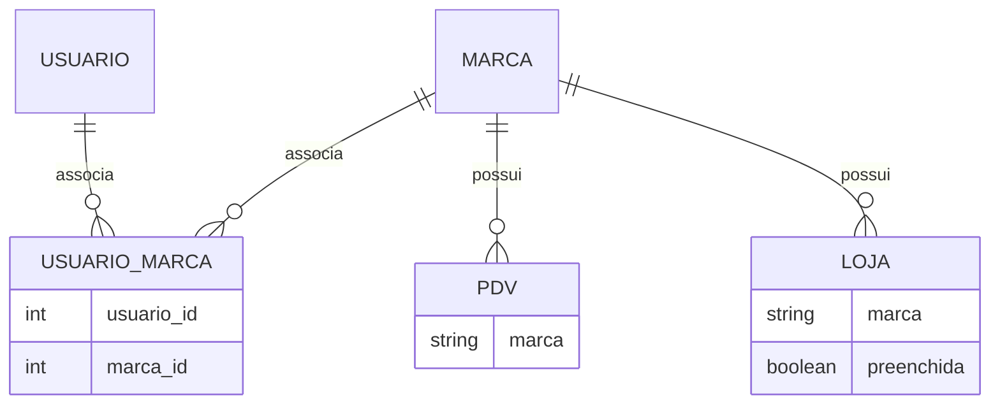

# Documentação Técnica - JK Promoter

## 1. Visão Geral do Sistema

O JK Promoter é uma aplicação web desenvolvida com Next.js e Supabase que gerencia:
- Cadastro de PDVs (Pontos de Venda)
- Gestão de Lojas e Marcas
- Relacionamento entre Promotores e Marcas
- Relatórios de desempenho

## 2. Estrutura de Tabelas Principais

### Tabela `pdv`
- **marca**: Texto (obrigatório)
- Relacionada com a tabela `marca` através de `marca_id`

### Tabela `loja`
- **marca**: Texto (obrigatório)
- **preenchida**: Boolean (default: false)
- Relacionada com outras entidades do sistema

### Tabela `marca`
- Armazena as marcas disponíveis no sistema
- Relacionada com PDVs e Lojas

### Tabela `usuario_marca`
- Gerencia o relacionamento entre usuários e marcas
- Permite que promotores sejam associados a múltiplas marcas

## 3. Relacionamentos entre Entidades

## 4. Fluxos Principais

### 4.1 Cadastro de PDV
1. Promotor seleciona a marca
2. Preenche informações do PDV
3. Sistema valida e persiste os dados
4. Atualiza status da loja associada

### 4.2 Gestão de Promotores
1. Administrador cadastra novo promotor
2. Associa marcas ao promotor
3. Promotor pode visualizar apenas as marcas associadas

### 4.3 Relatórios
- Lojas por marca
- PDVs cadastrados
- Status de preenchimento

## 5. Integrações e Dependências

### 5.1 Supabase
- Banco de dados PostgreSQL
- Autenticação
- Armazenamento de arquivos
- Funções serverless

### 5.2 Next.js
- Frontend e API routes
- Renderização server-side
- Gerenciamento de estado

### 5.3 Bibliotecas Principais
- React Hook Form: Validação de formulários
- Zod: Schema validation
- Sonner: Notificações
- Lucide: Ícones
- Tailwind CSS: Estilização

## 6. Segurança

### 6.1 RLS (Row Level Security)
- Todas as tabelas possuem políticas de segurança
- Acesso restrito a usuários autenticados
- Controle de acesso baseado em roles

### 6.2 Autenticação
- Login via email/senha
- Gerenciamento de sessões
- Rotação de tokens JWT

## 7. Considerações Finais

Este documento fornece uma visão geral da arquitetura e funcionamento do sistema JK Promoter. Para detalhes específicos de implementação, consultar o código fonte e documentação técnica complementar.
